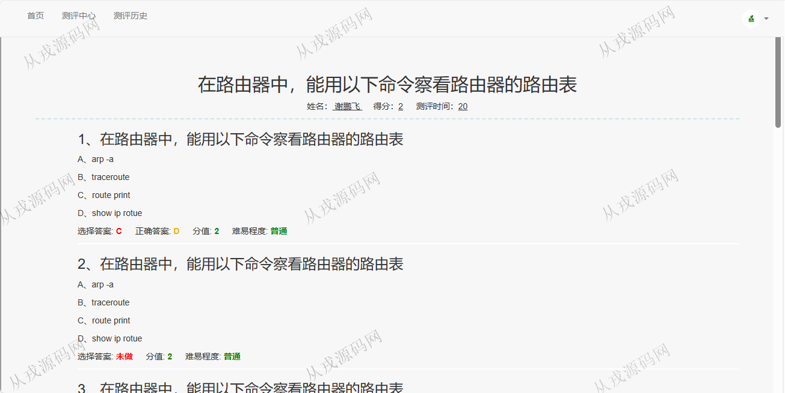
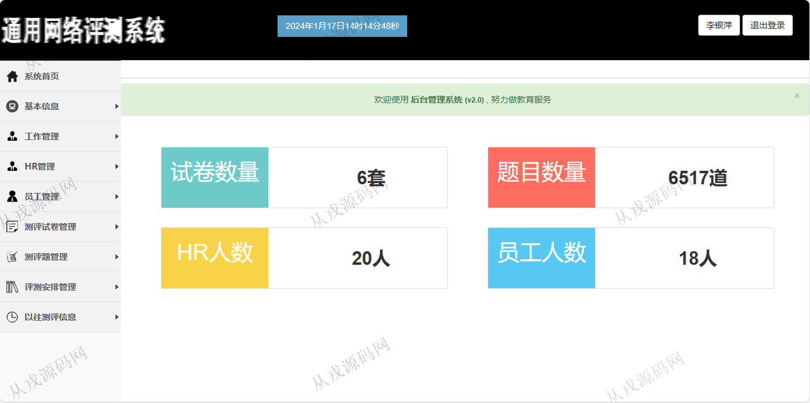
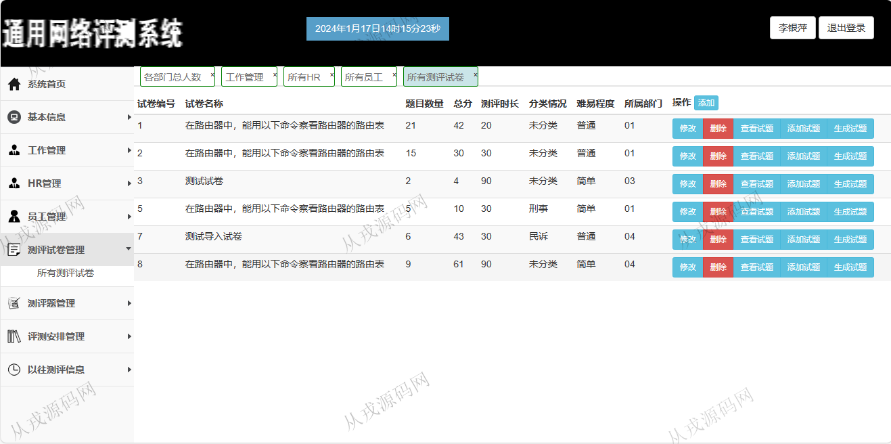
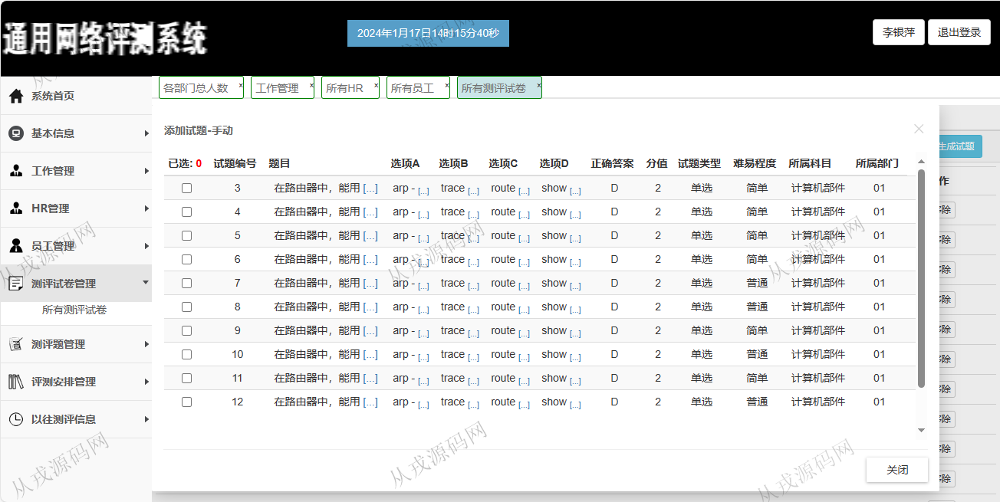
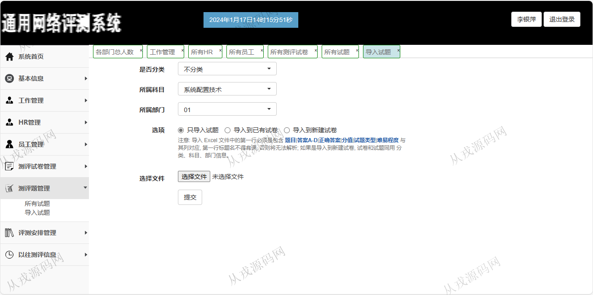
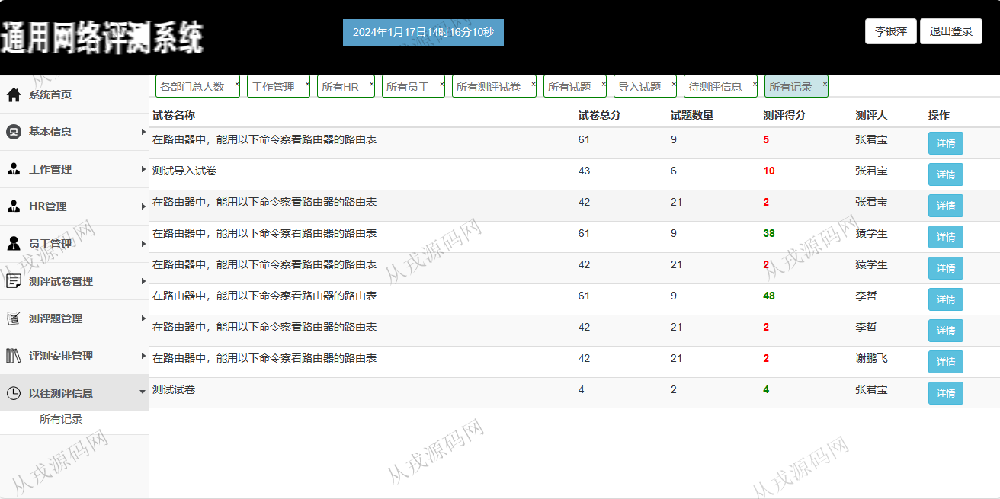

<h1 align="center">165.网络测评管理系统</h1>

 获取sql文件 QQ: 386869957 QQ群: 377586148 

 [更多源码项目: 从戎源码网](https://armycodes.com/) 

## 简介

> 本代码来源于网络,仅供学习参考使用!
>
> 提供1.远程部署/2.修改代码/3.设计文档指导/4.框架代码讲解等服务
> 
> 用户端访问地址：http://localhost:8080/index.jsp
> 
> xiepengfei 123456
> 
> 管理后台：http://localhost:8080/admin/login.jsp
> 
> liyinping 123456
> 

## 项目介绍
基于ssm的网络测评管理系统：前端 jsp、jquery、bootstrap，后端 springmvc、spring、mybatis；角色分为管理员、用户；集成在线测评，测评试卷管理等功能于一体的系统。

## 功能介绍

- 基本功能：登录、注册，退出
- 测评中心：测评列表，测评回顾
- 员工管理：员工信息的增删改查，密码修改
- 工作管理：各部门人员列表展示，各部门人数统计（折线图展示）
- 测评试卷管理：试卷的增删改查，查看试题，添加试题，生成试题
- 测评安排管理：待测评信息的增删改查
- 以往测评信息：以往测评信息列表查询，详情查看（试题列表回顾，包含答题错误选项和正确选项）

## 环境

- <b>IntelliJ IDEA 2021.3</b>

- <b>Mysql 5.7.26</b>

- <b>Tomcat 7.0.73</b>

- <b>JDK 1.8</b>

## 运行截图

